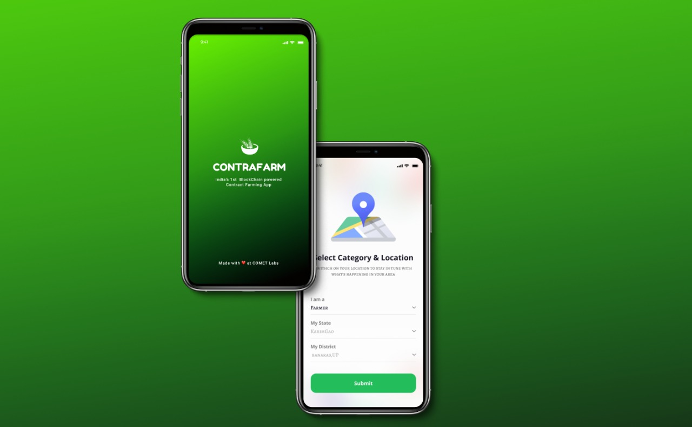
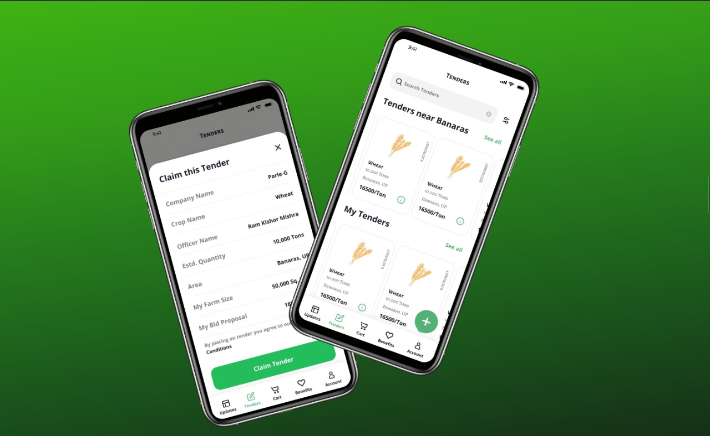
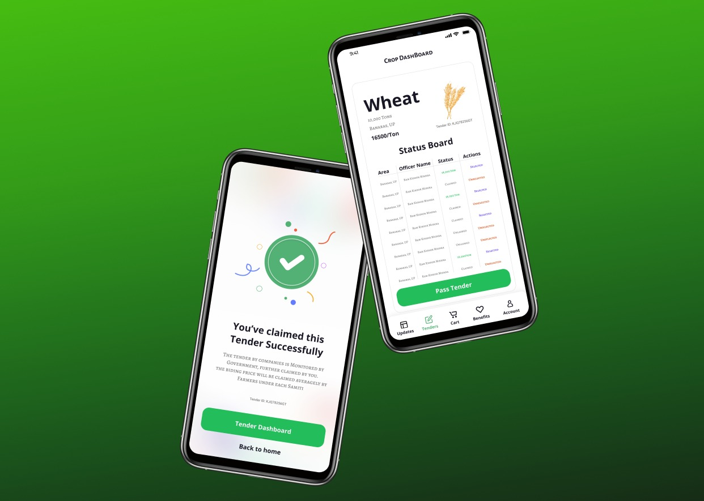
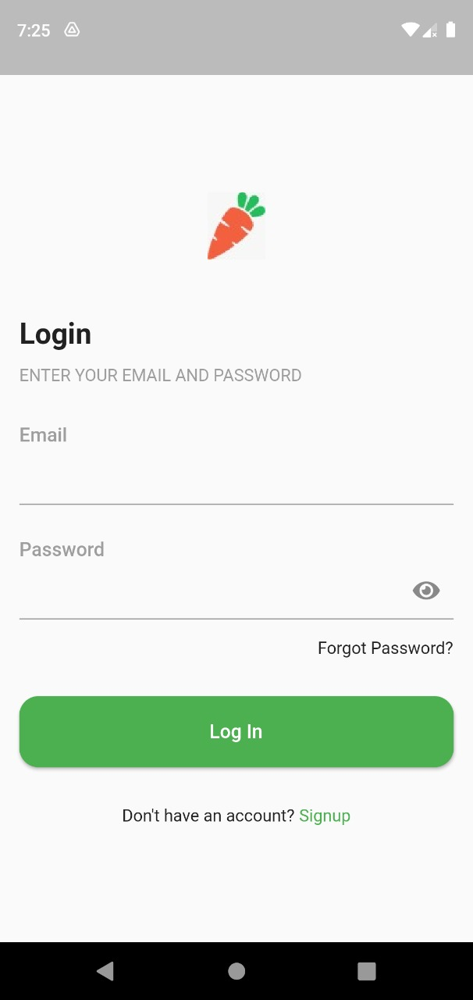
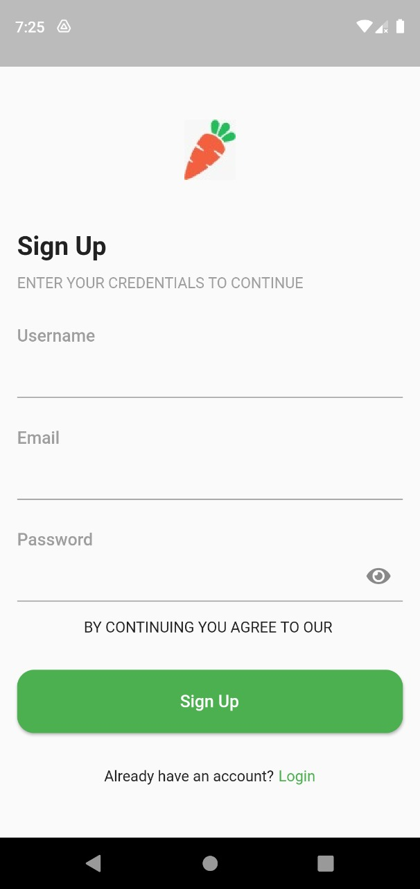

# Project Description:
1. **Project Name:** ContraFarm
2. **Tagline:** India‘s 1st Block Chain Powered Contract Farming App

# Problem Statement:
The problem statement deals with the two current major scenarios : First, India is an agricultural country and major part of its GDP is dependent on agriculture, therefore there is requirement of various agricultural reforms or amendments like recently [Agriculture Reform Bill 2020](https://prsindia.org/billtrack/the-farmers-empowerment-and-protection-agreement-on-price-assurance-and-farm-services-bill-2020) more specifically Contract Farming i.e. Pricing before Farming to be implemented in right way under a monitoring body with keeping in mind transparency of such a huge data among farmers, APMC (Middleman), company and government officials (monitoring body) to avoid riots & protests which are causing loss of life too. Secondly, in such unprecedented times of  COVID – 19 everything is switching from offline mode to online keeping in mind preventive measures and India is rapidly approaching towards Digital Revolution, so there is requirement of a digital, user-friendly, feasible, easy-to-use technological innovation for everyone who takes part in Contact Farming keeping the first scenario into the account.

# Proposed Solution:
The solution we proposed is like wise that we are developing  a digital solution i.e. an app called as CONTRA-FARM using Flutter Development and Block Chain. So, basically as discussed in problem statement, we are giving three profiles at a time i.e. farmers, middleman (APMC) & company with monitoring power to government, user will choose them accordingly and make required login. We are also taking location of the user to take into account to observe the crop pattern, crops they grow and crop requirement etc accordingly. Now, to implement the Contract Farming, we have different roles and access according to profile user choose : 

1. **Company:** They can propose that they want this much let’s say 16,000 kg of wheat from a certain area & they are going to pay INR1 per kg and this information will be visible to all the farmers & middlemen of that particular area.

2. **Farmer:** Now farmers of that certain area have choice to accept the contract and it will be based on majority (average) of farmers decision like let’s say out of 180 farmers, 150 farmers agree with the cost of INR 18,000, therefore that price is finalised for crops they grow from farmer’s side.

3. **Middle Man (APMC):** Now, this data of finalised price will be displayed to middleman’s profile & will be verified by middleman and then it will be redirected to company. Accordingly, company will decide out of let’s say 10 middlemen of that area, 2-3 middlemen are agreeing with 18,000 on an average price and then deal will be finalised between company and farmers via middleman through Contra Farm App.

4. **Government Officials:** They have all the database of all transactions, tenders proposed and passed , registered APMCs, farmers, companies for all the regulatory purposes.

Now, the use of Block Chain is that all the data stored and code is in form of smart contract and get added to its Block Chain in every instance of update. Smart Contract includes data about what, who & when about the tender, bidding prices etc and then the time when middle man validate it and then this data is transferred to farmer, what is his finalised average price and then this data is transferred to APMC for validation and thus to company, after that how company validate which middlemen from that area etc and all this huge data is displayed to everyone (farmers, company, middleman, govt. officials), therefore transparency  is withheld throughout this process via Contra-Farm app -transparent, easily accessible, and efficient marketing platform.

# Tech-Stack Used:
1. Flutter Development (**Dart**)
2. BlockChain (**Ethereum Track**)
3. Web3
4. MetaMask
5. Rinekby Test Network

# SnapShots:
 &nbsp;&nbsp;&nbsp;
 &nbsp;&nbsp;&nbsp;
 &nbsp;&nbsp;&nbsp;
 &nbsp;&nbsp;&nbsp;
 &nbsp;&nbsp;&nbsp;
 &nbsp;&nbsp;&nbsp;

# Presentation:
 - [Let's See Presentation]()
# Video Demo & WorkFlow Visualisation:
1. [Let's See Demo]() 
2. [WorkFlow Visualisation](https://www.figma.com/file/gKfVYnFcNWX0DHKrMSGQ5j/ContraFarm?node-id=10%3A291)
)

# Contributors ✨:
1. **Team Name:** COMET LABS
2. **Team Members:**
<table>
	<tr>
    <td align="center">
            <a href="https://github.com/cyber-venom003">
              <br />
              <sub><b>Tejas Agarwal</b></sub>
            </a><br/>
   </td>
   <td align="center">
            <a href="https://github.com/raghav1701">
              <br />
              <sub><b>Raghav Agarwal</b></sub>
            </a><br/>
   </td> 
   <td align="center">
            <a href="https://github.com/prashantkatiyar9777">
              <br />
              <sub><b>Prashant Milan Katiyar</b></sub>
            </a><br/>
   </td> 
   <td align="center">
            <a href="https://github.com/koolgax99">
              <br />
              <sub><b>Nihar Sanda</b></sub>
            </a><br/>
   </td> 
   <td align="center">
            <a href="https://github.com/achalesh27022003">
              <br />
              <sub><b>Achalesh Lakhotiya</b></sub>
            </a><br/>
   </td> 
</table>
 
# How to set it up locally?:
1. Fork the Repository.
2. Clone the Repository.
3. use ``` flutter run ```.

# Getting Started
This project is a starting point for a Flutter application.
A few resources to get you started if this is your first Flutter project:

- [Lab: Write your first Flutter app](https://flutter.dev/docs/get-started/codelab)
- [Cookbook: Useful Flutter samples](https://flutter.dev/docs/cookbook)

For help getting started with Flutter, view our
[online documentation](https://flutter.dev/docs), which offers tutorials,
samples, guidance on mobile development, and a full API reference.

